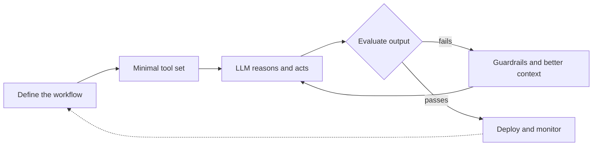

# Sumair

**AI Automation Developer · Agentic AI & Backend Engineering**

Designing LLM-powered systems that automate real workflows, with the engineering discipline to keep them reliable.

[Focus](#focus) · [Live Activity](#live-activity) · [Engineering Approach](#engineering-approach) · [Stack](#stack) · [Contact](#contact)

---

## Focus

| Area | What it means in practice |
|---|---|
| **Agentic AI** | Tool-using LLM agents that plan, act, and recover from failure |
| **RAG Systems** | Embeddings, vector search, and retrieval that is measured, not guessed |
| **Workflow Automation** | n8n and custom pipelines that remove repetitive manual work |
| **Backend Engineering** | Python/Django and Laravel services, REST and GraphQL APIs |
| **Deployment** | Dockerised services on AWS |

---

## Live Activity

> This section is generated by a scheduled GitHub Action ([`update-readme.yml`](.github/workflows/update-readme.yml)). It refreshes daily; nothing below is edited by hand.

### Profile snapshot

<!--STATS:START-->
Waiting for the first automated run.
<!--STATS:END-->

### Recently active repositories

<!--REPOS:START-->
Waiting for the first automated run.
<!--REPOS:END-->

### Recent pushes

<!--ACTIVITY:START-->
Waiting for the first automated run.
<!--ACTIVITY:END-->

Last refreshed: <!--UPDATED:START-->never<!--UPDATED:END--> (UTC)

---

## Engineering Approach

1. **Start from the workflow, not the model.** Understand what the human does today before automating it.
2. **Keep the toolset small.** Fewer tools means fewer ways for an agent to go wrong.
3. **Evaluate before shipping.** An agent that cannot be measured cannot be trusted.
4. **Automate the boring parts of my own work too**, including this profile.

---

## Stack

| Layer | Technologies |
|---|---|
| Languages | Python, PHP, JavaScript |
| Backend | Django, Django REST Framework, Laravel, GraphQL |
| AI | LLMs, Agentic AI, RAG, MCP |
| Automation | n8n, GitHub Actions |
| Infrastructure | Docker, AWS, Git, Postman |

---

## Contact

- GitHub: [@sumairali01](https://github.com/sumairali01)
- LinkedIn: _add your link_
- Email: _add your email_

Open to collaboration on AI automation, agent workflows, and backend projects.

 

