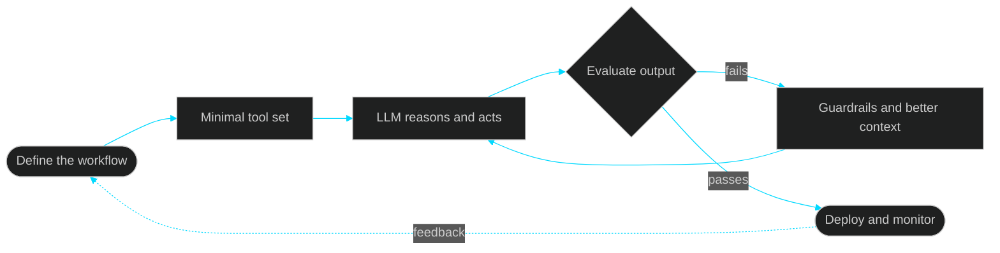

<div align="center">


<a href="https://github.com/sumairali01">
  
</a>

<br/>


<br/><br/>

[**Focus**](#-what-i-do) &nbsp;·&nbsp; [**Live Activity**](#-live-activity) &nbsp;·&nbsp; [**How I Build**](#-how-i-build-agents) &nbsp;·&nbsp; [**Stack**](#-tech-stack) &nbsp;·&nbsp; [**Contact**](#-lets-connect)

</div>

<br/>

##  What I Do

I turn LLMs from impressive demos into **reliable systems that automate real workflows**, combining solid backend engineering with intelligent agents.

<table>
<tr>
<td width="33%" valign="top">

###  Agentic AI
Tool-using LLM agents that **plan, act, and recover** from failure instead of just chatting.

</td>
<td width="33%" valign="top">

###  RAG Systems
Embeddings, vector search, and retrieval that is **measured, not guessed**.

</td>
<td width="33%" valign="top">

### ⚙️ Automation
n8n and custom pipelines that **remove repetitive manual work** end to end.

</td>
</tr>
<tr>
<td width="33%" valign="top">

###  Backend
Python/Django and Laravel services with **REST and GraphQL** APIs.

</td>
<td width="33%" valign="top">

### 🔌 MCP & Tools
Connecting agents to real systems through **MCP and tool integrations**.

</td>
<td width="33%" valign="top">

### ☁️ Deployment
**Dockerised** services shipped to AWS, built to be repeatable.

</td>
</tr>
</table>

<br/>

##  Live Activity

>  **This section writes itself.** A scheduled GitHub Action ([`update-readme.yml`](.github/workflows/update-readme.yml)) runs [`update_readme.py`](scripts/update_readme.py) every day and commits fresh data. Nothing below is edited by hand.

####  Profile snapshot

<!--STATS:START-->
Waiting for the first automated run.
<!--STATS:END-->

####  Recently active repositories

<!--REPOS:START-->
Waiting for the first automated run.
<!--REPOS:END-->

####  Recent pushes

<!--ACTIVITY:START-->
Waiting for the first automated run.
<!--ACTIVITY:END-->

<sub>⏱ Last refreshed: <!--UPDATED:START-->never<!--UPDATED:END--> (UTC)</sub>

<br/>

##  How I Build Agents



| | Principle | Why it matters |
|:-:|---|---|
| **1** | **Start from the workflow, not the model** | Understand what a human does today before automating it |
| **2** | **Keep the toolset small** | Fewer tools means fewer ways for an agent to go wrong |
| **3** | **Evaluate before shipping** | An agent that cannot be measured cannot be trusted |
| **4** | **Automate my own work too** | This profile updates itself, and that's the point |

<br/>

## 🛠 Tech Stack

<div align="center">

**Languages**


**Backend**


**AI & Automation**


**Cloud & Tools**


</div>

<br/>

##  Currently

```diff
+ NOW    Building backend apps with Python and Django
+ NOW    Experimenting with agents, RAG, and n8n workflows
! NEXT   Shipping an end-to-end RAG project with an evaluation loop
! NEXT   Building an MCP server that exposes useful tools to an agent
- LATER  Deploying agent systems on AWS with Docker and monitoring
```

<br/>

## Let's Connect

I'm open to collaborating on **AI automation, agent workflows, and backend projects**. If a repetitive process eats hours of your week, I'd like to hear about it.

<div align="center">

<a href="https://github.com/sumairali01"></a>
<a href="mailto:YOUR_EMAIL"></a>
<a href="https://www.linkedin.com/in/YOUR_LINKEDIN"></a>

<br/><br/>


<br/>


</div>
