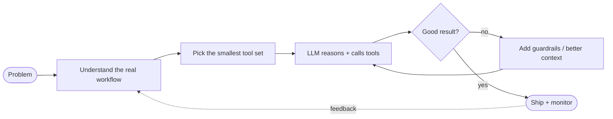

<div align="center">

```
┌──────────────────────────────────────────────┐
│  $ whoami                                    │
│  > sumair — agent builder, backend engineer  │
│  $ status                                    │
│  > online · learning · shipping              │
└──────────────────────────────────────────────┘
```

**I build software that can think a few steps ahead.**

</div>

---

## `agent.config.yaml`

```yaml
name: Sumair
role: AI Automation Developer
background: Computer Science graduate
mission: >
  Turn LLMs from impressive demos into reliable systems
  that do real work for real people.

focus:
  - agentic AI and tool-using LLMs
  - RAG pipelines (embeddings, vector search)
  - workflow automation

backbone:
  languages: [Python, PHP, JavaScript]
  frameworks: [Django, Django REST, Laravel]
  apis: [REST, GraphQL]

toolbelt:
  automation: [n8n, MCP]
  infra: [Docker, AWS, Git]
  testing: [Postman]

principles:
  - make it work, then make it reliable
  - an agent without guardrails is a liability
  - ship small, learn fast
```

---

## How I think about building agents



---

## Skill levels (honest edition)

| Area | Where I am | What I'm doing about it |
|---|---|---|
| Python / Django | 🟢 Comfortable | Building real APIs |
| Laravel / PHP | 🟢 Comfortable | Backend + REST work |
| LLM apps & prompts | 🟡 Growing fast | Daily experiments |
| RAG & vector search | 🟡 Learning by building | Embeddings, retrieval quality |
| MCP & tool integration | 🟡 Exploring | Connecting agents to real tools |
| Docker & AWS | 🟠 Leveling up | Deploying what I build |

---

## Now / Next / Later

```diff
+ NOW    Building backend apps with Python & Django
+ NOW    Experimenting with agents, RAG, and n8n workflows
! NEXT   Ship an end-to-end RAG project with a proper eval loop
! NEXT   Build an MCP server that exposes useful tools to an agent
- LATER  Deploy agent systems on AWS with Docker, monitoring included
```

---

<details>
<summary><b> Things I'm curious about right now</b></summary>

<br>

- How do you *measure* whether an agent is actually good?
- When is RAG the right answer, and when is it overkill?
- How small can an agent's toolset be while still being useful?
- What makes an automation survive contact with messy real-world data?

</details>

<details>
<summary><b>🤝 Let's work on something</b></summary>

<br>

I'm open to collaborating on AI automation, agent workflows, and backend projects.
If you have a repetitive process that eats hours every week, I'd like to hear about it.

- GitHub: [@sumairali01](https://github.com/sumairali01)
- Add your LinkedIn / email here

</details>

---

<div align="center">

<sub>`exit code 0` · thanks for stopping by</sub>

<br>


</div>
